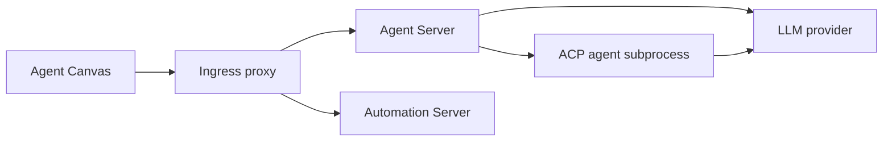
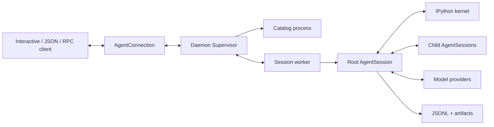
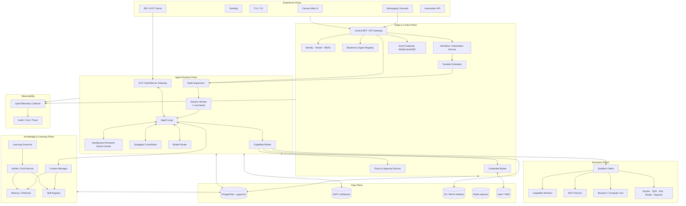
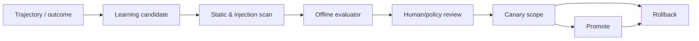

# OpenHands + Hermes Agent + Prime Agent
## Ayrıntılı Kod/Mimari Analizi ve Karma Nihai Mimari

**İnceleme tarihi:** 15 Ağustos 2026  
**Amaç:** Üç projeyi yalnızca özellik düzeyinde karşılaştırmak değil; güçlü taraflarını, teknik borçlarını ve güvenlik sınırlarını kaynak kodundan çıkarıp uygulanabilir tek bir hedef mimaride birleştirmek.

---

## İçindekiler

1. [Yönetici özeti](#1-yönetici-özeti)
2. [Kapsam, yöntem ve incelenen sürümler](#2-kapsam-yöntem-ve-incelenen-sürümler)
3. [OpenHands ayrıntılı analizi](#3-openhands-ayrıntılı-analizi)
4. [Prime Agent ayrıntılı analizi](#4-prime-agent-ayrıntılı-analizi)
5. [Hermes Agent ayrıntılı analizi](#5-hermes-agent-ayrıntılı-analizi)
6. [Karşılaştırma matrisi](#6-karşılaştırma-matrisi)
7. [Nihai karar: hangi proje hangi katmanın temeli olmalı?](#7-nihai-karar-hangi-proje-hangi-katmanın-temeli-olmalı)
8. [Önerilen nihai mimari: Hybrid Agent Fabric](#8-önerilen-nihai-mimari-hybrid-agent-fabric)
9. [Ajan çalışma zamanı ve yürütme modeli](#9-ajan-çalışma-zamanı-ve-yürütme-modeli)
10. [Çoklu ajan ve uzun süren görev modeli](#10-çoklu-ajan-ve-uzun-süren-görev-modeli)
11. [Araç, RLM, MCP ve sandbox tasarımı](#11-araç-rlm-mcp-ve-sandbox-tasarımı)
12. [Hafıza ve kontrollü öz-iyileştirme](#12-hafıza-ve-kontrollü-öz-iyileştirme)
13. [Güvenlik mimarisi](#13-güvenlik-mimarisi)
14. [Veri, olay ve tutarlılık modeli](#14-veri-olay-ve-tutarlılık-modeli)
15. [Plugin/skill mimarisi](#15-pluginskill-mimarisi)
16. [Gözlemlenebilirlik ve değerlendirme](#16-gözlemlenebilirlik-ve-değerlendirme)
17. [Dağıtım profilleri ve teknoloji seçimleri](#17-dağıtım-profilleri-ve-teknoloji-seçimleri)
18. [Önerilen monorepo yapısı](#18-önerilen-monorepo-yapısı)
19. [Uygulama ve geçiş yol haritası](#19-uygulama-ve-geçiş-yol-haritası)
20. [Riskler, ödünleşimler ve kaçınılması gerekenler](#20-riskler-ödünleşimler-ve-kaçınılması-gerekenler)
21. [Başarı ölçütleri](#21-başarı-ölçütleri)
22. [Sonuç](#22-sonuç)
23. [Kaynak haritası](#23-kaynak-haritası)

---

# 1. Yönetici özeti

Üç projeyi tek cümleyle konumlandırırsak:

- **OpenHands**, en güçlü **web tabanlı kontrol merkezi ve çoklu backend/ajan istemcisi**.
- **Prime Agent**, en güçlü **uzun ömürlü, yeniden bağlanılabilir, recursive ve programlanabilir ajan çalışma zamanı**.
- **Hermes Agent**, en geniş **araç, kanal, sağlayıcı, sandbox, güvenlik, hafıza ve operasyon ekosistemi**.

## En önemli sonuç

Bu üç projeyi doğrudan birbirine yamamak doğru çözüm değildir. Nihai sistem şu şekilde kurulmalıdır:

1. **Runtime çekirdeği Prime Agent yaklaşımından alınmalı.**  
   Oturum başına worker, supervisor, generation/sequence tabanlı yeniden bağlanma, komut idempotency journal’ı, session lease’leri, kalıcı alt ajanlar ve IPython/RLM modeli bu katmanın temeli olmalı.

2. **Kullanıcı ve operasyon yüzeyi OpenHands Agent Canvas’tan alınmalı.**  
   Web UI, terminal/dosya/browser/conversation görünümleri, çoklu backend seçimi, ACP ajanları, otomasyon ekranları, React Query tabanlı veri erişimi ve deklaratif manifest yaklaşımı kullanılmalı.

3. **Yetenek ve güvenlik katmanı Hermes’ten alınmalı.**  
   Çoklu mesajlaşma kanalları, sağlayıcı profilleri, geniş araç seti, Docker/SSH/Modal/Daytona/Vercel gibi yürütme backend’leri, onay sistemi, egress kontrolü, skill karantinası/taraması, hafıza, session search ve OTLP gözlemlenebilirliği taşınmalı.

4. **Hiçbir projenin zayıf güvenlik varsayımı aynen alınmamalı.**
   - OpenHands’in tarayıcı `localStorage` içinde backend API anahtarı tutması,
   - Prime Agent’ın IPython/kernel süreçlerini güvenlik sandbox’ı saymaması,
   - Hermes’in plugin ve bazı araç korumalarını “heuristic, boundary değil” olarak bırakması
   nihai mimaride düzeltilmeli.

5. **Nihai sistem çift yürütme kanallı olmalı.**
   - Saf hesaplama, veri dönüştürme ve küçük orkestrasyon için **sandbox içi kalıcı Python/RLM kanalı**.
   - Dosya sistemi dışına çıkan, ağ kullanan, kimlik bilgisi isteyen veya geri döndürülemez yan etki üreten işler için **şemalı, politika denetimli capability/tool kanalı**.

Bu tasarım raporda **Hybrid Agent Fabric (HAF)** adıyla anılmaktadır.

---

# 2. Kapsam, yöntem ve incelenen sürümler

## 2.1 İncelenen tam commit’ler

| Proje | Commit | Son commit zamanı/mesajı | İncelenen güncel sürüm |
|---|---|---|---|
| OpenHands | `0d15c5e79e91a659f238954e1db8a3da289c4801` | 2026-08-15 — `feat(canvas): present structured error outcomes` | `v1.13.0` |
| Prime Agent | `97b994c3d7c45ca1ae635190e91e9e58ddf2577c` | 2026-08-14 — supervisor/RLM spawn ledger değişikliği | `v0.7.2` |
| Hermes Agent | `165c889e5b4277b56dadd42949a4112c1e6175a6` | 2026-08-15 — CLI keyboard protocol düzeltmesi | `v2026.8.13` / ürün sürümü `0.20.1` |

## 2.2 Kaynak hacmi — yaklaşık statik ölçüm

Bu sayılar kalite puanı değildir; sistemlerin ölçek ve karmaşıklığını göstermeyi amaçlar. Generated dosyalar, örnekler ve bazı vendor kaynakları toplamı etkileyebilir.

| Proje | Üretim kaynakları | Test kaynakları | Dikkat çeken büyük dosyalar |
|---|---:|---:|---|
| OpenHands | yaklaşık 130.746 satır / 1.150 TS-JS-Python dosyası | yaklaşık 119.241 satır / 574 dosya | 7 üretim dosyası 1.000 satırın üzerinde |
| Prime Agent | yaklaşık 175.387 satır / 366 kaynak dosyası | yaklaşık 164.086 satır / 467 dosya | `agent-session.ts` 11.288; `interactive-mode.ts` 10.024; daemon dosyaları 5–7 bin satır |
| Hermes Agent | çekirdek yaklaşık 794.457, uygulamalar yaklaşık 519.278 satır | yaklaşık 771.803 satır / 3.075 dosya | 100’den fazla üretim dosyası 2.000 satırın, 32 dosya 5.000 satırın üzerinde |

## 2.3 İnceleme yöntemi

İncelemede aşağıdakiler kaynak kodu ve proje içi mimari belgeler üzerinden kontrol edildi:

- Ana ajan döngüsü ve model çağrı akışı
- Oturum yaşam döngüsü, crash recovery ve yeniden bağlanma
- Çoklu ajan/delegation
- Context compaction ve uzun görevler
- Hafıza ve öz-iyileştirme
- Araç sistemi, MCP, skills ve plugins
- Sandbox, onay, credential ve ağ güvenliği
- Sağlayıcı soyutlaması
- Web/TUI/desktop/messaging yüzeyleri
- Otomasyon ve scheduler
- Gözlemlenebilirlik
- CI, test yapısı ve kodun modülerliği

### Sınırlama

Bu çalışma kapsamlı bir **statik mimari/kod incelemesidir**. Üç ürünün tüm sağlayıcılarla canlı, uzun süreli maliyet/latency benchmark’ı yapılmadı. Özellikle OpenHands’in güncel çekirdek ajan sunucusu ayrı `software-agent-sdk` deposunda olduğu için, bu rapordaki OpenHands analizi verilen `OpenHands/OpenHands` deposunun güncel kapsamına — Agent Canvas’a — odaklanır.

---

# 3. OpenHands ayrıntılı analizi

## 3.1 Kritik kapsam değişikliği

Güncel `OpenHands/OpenHands` ana dalı, geçmişteki monolitik Python coding-agent deposu gibi ele alınmamalıdır. İncelenen sürümün README’si projeyi açıkça **Agent Canvas** olarak tanımlar. Bu depo:

- React/TypeScript frontend,
- yerel stack launcher’ları,
- Electron paketlemesi,
- Agent Server API adapter’ları,
- Automation Server entegrasyonu,
- Helm/Docker dağıtımı

üzerine yoğunlaşır.

Çekirdek ajan yürütümü **OpenHands Agent Server** içinde, o da ayrı `software-agent-sdk` deposundadır. Automation backend de ayrı `OpenHands/automation` projesidir. Dolayısıyla bu repo mimari olarak esasen bir **experience/control plane client**’ıdır.

Bu ayrım nihai mimari için çok değerlidir: OpenHands’i runtime çekirdeği olarak değil, güçlü bir kontrol merkezi olarak kullanmak gerekir.

## 3.2 Sistem sınırları

OpenHands’in kendi mimari belgesi Agent Canvas’ın sorumluluklarını net ayırır:

**Sorumlu olduğu alanlar:**

- Conversation, terminal, browser, files, settings ve automation UI
- Backend seçimi ve frontend state’i
- UI işlemlerini Agent Server API çağrılarına çevirme
- Standalone uygulama ve gömülebilir component library paketleme

**Sorumlu olmadığı alanlar:**

- Ajan aksiyonlarının yürütülmesi
- Sandbox/workspace izolasyonu
- Backend dışındaki credential barındırma
- Automation backend olmadan zamanlanmış workflow yürütme

Bu boundary, üç proje içinde frontend ile runtime ayrımını en anlaşılır kuran modeldir.

## 3.3 Çalışma topolojisi

Temel topoloji:



Canvas aynı anda birden fazla Agent Server backend’i kaydedebilir ve aralarında geçiş yapabilir. Backend; local, uzak VM veya cloud olabilir. Bu, son kullanıcı açısından güçlü bir “tek konsol, çok çalışma ortamı” modelidir.

## 3.4 ACP desteği

OpenHands’in en iyi mimari kararlarından biri **Agent Client Protocol (ACP)** desteğidir.

Canvas doğrudan yalnızca OpenHands ajanına bağlı değildir. Agent Server:

- Claude Code,
- Codex,
- Gemini CLI,
- başka ACP uyumlu ajanları

subprocess olarak çalıştırıp JSON-RPC/stdio üzerinden yönetebilir. Canvas dış ajanı doğrudan bilmek zorunda kalmaz; konuşma ve event akışını Agent Server üzerinden izler.

Bu yaklaşım iki fayda sağlar:

1. UI, ajan motorundan ayrılır.
2. Nihai sistem üçüncü taraf ajanları “plugin” gibi değil, standart protokol uçları olarak çalıştırabilir.

## 3.5 Frontend state ve event akışı

Önemli yapı taşları:

- **React Query:** backend verisi, cache ve mutation yönetimi
- **Zustand:** conversation/UI state
- **REST + WebSocket hibriti:** geçmiş event’ler REST ile sayfalanır; canlı tail WebSocket ile gelir
- **Replay anchor:** WS bağlantısı `resend_mode="since"` ve timestamp kullanır; uygun anchor yoksa `all` ile geri düşer
- **Optimistic message state:** kullanıcı mesajı sunucu echo’su gelene kadar geçici gösterilir
- **Backend-scoped query keys:** backend değişiminde veri karışmasının önüne geçilir

REST ile geçmişi yükleyip WS ile yalnızca tail’i alma kararı, büyük konuşmalarda “her reconnect’te tüm geçmişi tekrar stream etme” sorununu azaltır.

### Güçlü taraf

Reconnect mantığı UI’de oldukça ayrıntılı ele alınmış. Conversation değişiminde event, browser ve metrics state’inin atomik/öngörülebilir sıfırlanmasına özel dikkat var.

### Zayıf taraf

Bu güvenilirlik davranışlarının önemli bir kısmı 1.176 satırlık `conversation-websocket-context.tsx` içinde toplanmış. Transport state machine ayrı, framework-bağımsız bir modüle ayrılmadığı için test ve yeniden kullanım maliyeti büyüyor.

## 3.6 Çoklu backend registry

Canvas backend tanımı şu temel bilgileri taşır:

- `id`, `name`, `host`
- `kind: local | cloud`
- `authMode: api-key | cookie`
- `apiKey`
- credential değişimini yansıtan `connectionRevision`

Aktif backend tab-scoped `sessionStorage` ile; default seçim ve backend listesi `localStorage` ile tutulur. Sağlıklı local backend fallback’i yapılır.

### İyi olan

- Backend seçiminin UI state’inden bağımsız bir registry olarak ele alınması
- Query ve cache’in backend kimliğine göre scope edilmesi
- Local ve cloud auth header’larının ayrılması

### Güvenlik sorunu

Backend API key’inin kalıcı olarak tarayıcı `localStorage` içinde saklanması nihai mimariye taşınmamalıdır. Herhangi bir XSS, üçüncü taraf script veya yanlış yetkilendirilmiş browser extension bu anahtarı okuyabilir.

Canvas Markdown renderer’ı `rehype-sanitize` ile güçlü biçimde temizliyor; `style`, `data:` URL ve `javascript:` gibi riskler engelleniyor. Ancak static server tarafında uygulama geneli için belirgin, sıkı bir Content-Security-Policy uygulanmıyor. Transcript export HTML’inde CSP var, ana uygulama sunucusunda aynı seviyede bir header katmanı görünmüyor.

**Nihai çözüm:** Tarayıcı hiçbir zaman backend anahtarını görmemeli; BFF üzerinden `HttpOnly`, `Secure`, `SameSite=Strict` session cookie kullanılmalı.

## 3.7 Otomasyon ve deklaratif manifest yaklaşımı

OpenHands’in en taşınabilir tasarımlarından biri automation manifest sistemidir.

Manifest:

- setup form alanlarını,
- trigger türlerini,
- gerekli integration/capability’leri,
- UI navigation/copy bilgisini,
- endpoint route’larını

deklaratif olarak tanımlar.

Ancak manifest keyfi kod taşımaz. Host yalnızca kapalı bir sözlükte bildiği:

- icon,
- metric,
- filter,
- sort,
- route,
- form tipi,
- placeholder

değerlerini kabul eder. Bilinmeyen alanlar ve markup reddedilir; manifestin hosta regex veya çalıştırılabilir expression vermesine izin verilmez.

Bu, plugin kaynaklı UI extensibility için çok iyi bir güvenlik modelidir: **“plugin UI kodu çalıştırmasın; hostun bildiği yapı taşlarını deklaratif olarak seçsin.”**

## 3.8 Child conversation modeli

Canvas ajan tarafından çağrılabilen client-side child conversation aracı sunar. Çocuk:

- local workspace içinde,
- yeni git worktree’de,
- shared workspace’de,
- cloud sandbox içinde

başlatılabilir.

Kod, replay sırasında aynı tool çağrısının ikinci kez — cloud’da potansiyel olarak ücretli — conversation açmaması için client-side ledger kullanır. Worktree oluşmazsa shared workspace’e fallback yapar ve çakışma riskini açıkça raporlar.

### Eleştiri

İdempotency ledger’ın browser `localStorage` içinde olması “en iyi çaba” seviyesindedir. Storage başarısız olursa duplicate launch riski kabul edilir. Nihai mimaride child spawn idempotency’si browser’a değil server-side command journal’a ait olmalıdır.

## 3.9 Dağıtım

OpenHands şunları sunar:

- npm CLI ile local full stack
- Docker all-in-one image
- Electron desktop
- deneysel Helm chart
- frontend-only/backend-only modları
- component library export’ları

Helm chart açık biçimde:

- tek replica,
- tek tenant,
- built-in kullanıcı auth/RBAC olmadan,
- ortak pod ve PVC üstünde

çalıştığını belirtir. Bu dürüst ama üretim için sınırlı bir modeldir.

## 3.10 Test ve kalite

Olumlu noktalar:

- Typecheck, ESLint, Prettier
- Vitest unit/component tests
- Playwright E2E ve mock-LLM E2E
- App + library build doğrulaması
- `npm pack --dry-run`
- Mutation testing altyapısı
- Live E2E’de fork PR’larına secret verilmemesi

## 3.11 OpenHands’in en iyi yanları

1. Çok güçlü web kontrol merkezi
2. Çoklu backend kavramı
3. ACP uyumluluğu
4. REST history + WS tail/replay modeli
5. Terminal/browser/files/changes/metrics UX’i
6. Deklaratif, kapalı sözlüklü automation manifestleri
7. Gömülebilir UI component library
8. Local, Docker, desktop ve K8s paketleme
9. İyi frontend test yüzeyi

## 3.12 OpenHands’in zayıf yanları

1. Verilen repo runtime çekirdeğini içermiyor; mimari değerlendirme birden fazla harici repo/paket olmadan tamamlanamıyor.
2. Agent Server, Automation ve TypeScript client sürümleri arasında version skew riski var.
3. Kod içinde, yayınlanmış TypeScript client henüz ilgili plugin management methodlarını taşımadığı için local interface ve `as unknown as` cast kullanılıyor; bu gerçek bir kontrat senkronizasyon riski.
4. Browser `localStorage` içinde backend API key saklanıyor.
5. Deneysel Helm dağıtımı tek tenant ve built-in auth’suz.
6. Bazı frontend/launcher dosyaları aşırı büyümüş durumda.
7. Child launch idempotency’si kısmen client-side.
8. Runtime güvenliği bu deponun değil, harici Agent Server’ın sorumluluğu; UI’nin sunduğu güvenlik algısı gerçek sandbox garantisiyle karıştırılmamalı.

## 3.13 Nihai mimariye alınacaklar

**Doğrudan alınabilir/adapte edilebilir:**

- Agent Canvas UI shell ve component’leri
- Backend selector UX’i
- Conversation/terminal/files/browser/metrics görünümleri
- ACP onboarding akışı
- Manifest validation yaklaşımı
- Markdown sanitization
- React Query cache modeli
- Library export stratejisi

**Aynen alınmamalı:**

- Browser’da kalıcı API key
- Browser-owned idempotency
- Tek pod/tek tenant üretim modeli
- Runtime servisleri arasında gevşek sürüm uyumluluğu

---

# 4. Prime Agent ayrıntılı analizi

## 4.1 Temel felsefe

Prime Agent iki ana kavram üzerine kuruludur:

1. **Recursive Language Model (RLM):** Context ve işler, kalıcı bir IPython ortamında programatik olarak yönetilir. Modelin varsayılan ana aracı `ipython`’dır.
2. **Continual Harness:** Prompt ekleri, memory, skill açıklamaları ve tekrar kullanılabilir subagent tanımları oturumdan daha uzun ömürlü, sürümlü ve geri alınabilir state hâline gelebilir.

Bu yaklaşım, klasik “LLM’ye 40 ayrı JSON tool ver” modelinden farklıdır. Model Python kodu ile arama, dönüştürme, shell, skill ve alt ajan çağrılarını kompoze eder.

## 4.2 Paket yapısı

Monorepo ana paketleri:

- `packages/ai`: çoklu provider/model streaming katmanı
- `packages/agent`: genel agent loop ve state
- `packages/coding-agent`: oturum, daemon, RLM, tools, compaction, TUI modları
- `packages/tui`: bağımsız terminal UI kütüphanesi
- `prime-agent-runtime`: kernel içinde çalışan Python `rlm` shim’i

Bu ayrım, üç proje içinde çekirdek ajan motorunu reusable package’lara ayırma konusunda en temiz başlangıçtır.

## 4.3 Process topolojisi

Normal interaktif akış:



### Sorumlulukların ayrımı

- **Client:** render, keyboard, local UI tercihleri
- **Supervisor:** discovery, routing, attachment, worker health, agent-to-agent message delivery, update coordination
- **Catalog process:** inactive/saved session taramaları
- **Worker:** bir root session ağacı, scheduler, kernel ve tüm descendants
- **AgentSession:** provider çağrısı, queue, tools, goals, compaction, transcript, child lifecycle

Bu process ownership modeli nihai mimarinin en değerli omurgasıdır.

## 4.4 Yeniden bağlanma ve replay

Public daemon protokolü:

- sürümlü command envelope,
- stable `clientId + commandId`,
- capability negotiation,
- `{generation, sequence}` event cursor,
- snapshot begin/chunk/end,
- büyük transcript için file-backed cache,
- reconnect/replay,
- mutation journal

kullanır.

Generation değiştiğinde eski sequence karşılaştırılmaz; eksik replay varsa snapshot yeni durable baseline olur. Bu, WebSocket sistemlerinde sık görülen “sequence sıfırlandı ama client eski cursor’a göre event drop etti” sorununu doğru şekilde çözer.

## 4.5 Idempotency ve crash recovery

Mutating command’lar `clientId + commandId` ile journal’a alınır.

- Tamamlanmış komut tekrar gelirse kayıtlı sonuç döner.
- Alınmış fakat sonucu durable değilse işlem “uncertain” sayılır ve otomatik tekrar edilmez.
- Client reconnect’te aynı command ID’yi korur.
- Worker crash’inde eski process group ve detached bash ağaçları temizlenir.
- Transcript’e görünür recovery marker yazılır.
- Root aynı active-session ID ile restore edilir.

Bu, “exactly once” iddiasında bulunmak yerine geri döndürülemez işlemlerde **uncertain outcome** gerçeğini kabul eden sağlıklı bir tasarımdır.

## 4.6 Lease modeli

Her persisted session, canonical JSONL path’e bağlı process-safe lease ile korunur.

- Worker target session’ı açmadan lease alır.
- Session switch sırasında yeni lease alınmadan eski lease bırakılmaz.
- Aynı session’ın iki process tarafından eşzamanlı yazılması engellenir.

Bu tasarım, nihai sistemde Postgres advisory lock veya distributed lease ile genişletilebilir.

## 4.7 RLM/IPython modeli

Varsayılan model aracı yalnızca `ipython`’dır. Python state:

- turn’ler arasında,
- compaction sonrasında,
- değişken/import/helper fonksiyon seviyesinde

kalıcıdır.

### Avantajları

1. Tool schema token maliyetini düşürür.
2. Çok adımlı veri işlemleri model context’i yerine Python değişkenlerinde kalır.
3. Aynı ara sonucu tekrar tekrar modele taşımaya gerek kalmaz.
4. Skills gerçek Python package’ları olabilir.
5. Alt ajanlar programatik olarak başlatılabilir.

### Riskleri

1. IPython model tarafından üretilmiş keyfi Python ve shell çalıştırır.
2. Kernel process ayrımı bir güvenlik sınırı değildir.
3. Tek güçlü araç, ayrıntılı policy/approval ve per-capability audit’i zorlaştırır.
4. Python environment’ına yüklenen skill/package tüm session boyunca güvenilir kod kabul edilir.
5. State restore sırasında pickle/dill benzeri kernel snapshot’ları bir trust boundary oluşturur.

Prime Agent bu sınırı doğru şekilde belgeliyor: worker ve kernel process izolasyonu yaşam döngüsü içindir, security sandbox değildir.

## 4.8 Subagent modeli

`await rlm("task", name="...")` çağrısı sonucu beklemez; admission handle döner. Child bağımsız `AgentSession` olarak çalışır.

Önemli özellikler:

- ayrı context ve session directory
- parent model/config/skills inheritance
- farklı model seçebilme
- default recursion depth sınırı
- parent-scoped child registry
- compaction/kernel restart/restore sonrasında registry devamlılığı
- completed child’a tekrar mesaj gönderme
- child usage’ını parent turn’e ayrı attribution ile ekleme

Child sonucu `rlm()` return değeri değildir; `agent_message` veya file üzerinden gelir. Bu, delegation’ı bloklamayan gerçek async modeldir.

## 4.9 Agent-to-agent iletişim

Supervisor active session ve retained child’lar arasında mesaj route eder.

Delivery mode’ları:

- `auto`: busy target’a steer, idle target’a normal teslim
- `steer`: aktif işe müdahale
- `follow_up`: mevcut iş bittikten sonra teslim

Mesaj size/rate/pending queue limitleri supervisor tarafından uygulanır. Identity kernel tarafından iddia edilmez; daemon sender kimliğini kendisi türetir.

## 4.10 Uzun süren görevler

Prime Agent bu alanda çok güçlüdür:

- UI kapanınca worker devam eder
- attach/detach
- persisted goals
- heartbeat
- RLM heartbeat
- one-shot ve cron schedule
- bounded autonomous mode
- quality gate komutları
- token/turn/time budget’ları
- context compaction

Scheduler tick’i teslimden önce claim edip next occurrence’ı ilerletir; crash belirsiz bir prompt’u tekrar oynatmaz. Missed tick’ler sınırsız backlog yerine coalesce edilir.

## 4.11 Autonomous quality gates

Autonomous mode default olarak sınırlıdır:

- continuation sayısı
- turn sayısı
- token
- wall clock
- gate retry
- gate timeout

Bir gate başarısız olduğunda workspace snapshot’ı değişmemişse aynı gate tekrar koşturulmaz. Bu hem maliyet hem de loop önleme açısından iyi bir karardır.

Ancak gate komutu normal OS permission’larıyla çalışır; güvenlik sandbox’ı yoktur.

## 4.12 Context compaction ve session tree

Session JSONL dosyası düz bir chat listesi değil, parent ID’li bir ağaçtır. Kullanıcı geçmiş turn’e dönebilir, branch açabilir ve terk edilen branch’i özetleyebilir.

Compaction:

- eski mesajları özetler,
- yakın mesajları korur,
- file tracking ve critical context taşır,
- kernel state’i kaybetmez,
- extension hook’larıyla özelleştirilebilir.

Branch summary ve normal compaction’ın ayrı kavramlar olması güçlü bir tasarım detayıdır.

## 4.13 Continual Harness

Harness entry türleri:

- `prompt`
- `memory`
- `skill`
- `subagent`

Scope:

- session-local
- açıkça istenirse global

`/refine` mevcut trajectory’yi inceleyip küçük create/update/delete edit’leri üretir. Base system prompt immutable kalır. Refinement event’lerinde before/after snapshot tutulur ve rollback yapılabilir.

### İyi taraf

- Öz-iyileştirme base prompt’u sessizce değiştirmez.
- Global yazım default değildir.
- Edit’ler evidence ve expected outcome taşır.
- Rollback vardır.
- Host ile kernel aynı state dosyasını yazarken mtime kontrolüyle stale overwrite azaltılır.

### Eksik taraf

- Refinement çıktısı yine LLM üretimidir; otomatik doğrulama ve canary/evaluation gate’i sınırlıdır.
- Global memory/skill promotion için organizasyon politikası, code signing veya insan review pipeline’ı çekirdeğin doğal parçası değildir.
- JSON state dosyası çoklu process/distributed kullanım için nihai storage değildir.

## 4.14 Extension modeli

Prime Agent extension yüzeyi çok geniştir:

- session lifecycle
- agent/turn/message events
- tool call/result interception
- provider request/response
- model selection
- UI components
- custom commands/tools
- compaction hooks
- sandbox/SSH örnekleri

Tool gate hataları fail-safe olacak şekilde tool’u bloke edebilir. Extension hatalarının çoğu agent’ı çalışır bırakır.

### Risk

Extension’lar full system permission ile çalışır. Permission gate bir örnek extension olarak mevcut olsa da, nihai güvenlik politikası yalnızca optional extension’a bırakılamaz.

## 4.15 ACP, JSON, RPC ve SDK

Prime Agent:

- ACP server olabilir,
- JSON event stream sunar,
- kendi zengin RPC protokolünü sunar,
- SDK olarak process içinde çalışabilir.

ACP’de standardın kapsamadığı subagent/goals/heartbeat/refinement bilgisi reverse-domain `_meta` altında taşınır. Standart client bu alanı görmezden gelebilir. Bu, interoperabiliteyi bozmadan extension taşımanın doğru yoludur.

## 4.16 Test ve kalite

Olumlu:

- package-level test ayrımı
- daemon, recovery, kernel ve process smoke testleri
- nightly process stress
- CI’de build/check/test matrix
- contributor trust gate
- action SHA pin’leri

Zayıf:

- Bazı temel sınıflar çok büyük: `agent-session.ts` 11 bin+, `daemon-mode.ts` 6.9 bin+, `daemon-supervisor.ts` 5.2 bin+
- `AgentSession` çok fazla sorumluluğu merkezileştirmiş durumda.
- npm bağımlılıklarının önemli kısmı caret range; Hermes kadar katı supply-chain pinning görülmüyor.
- Proje oldukça yeni ve sürüm `0.7.x`; protokoller hızlı evriliyor.

## 4.17 Prime Agent’ın en iyi yanları

1. Supervisor/worker/kernel process modeli
2. Detach/reattach ve background continuation
3. Generation + sequence replay
4. Snapshot ve backpressure tasarımı
5. Command idempotency/uncertain outcome
6. Session lease’leri
7. Programatik RLM/IPython
8. Kalıcı, async subagent ağacı
9. Direct agent messaging
10. Goals, heartbeat, schedule ve autonomous budget’lar
11. Context compaction + session tree
12. Local/global, rollback destekli continual harness
13. ACP/JSON/RPC/SDK yüzeyleri

## 4.18 Prime Agent’ın zayıf yanları

1. Kernel ve worker güvenlik sandbox’ı değil.
2. Default model aracı çok güçlü; side-effect policy granularity düşük.
3. Built-in güçlü approval/policy engine yerine extension örneklerine dayanma eğilimi var.
4. Web/messaging/control-plane UX’i sınırlı.
5. Kritik sınıflarda yoğunlaşmış yüksek complexity.
6. JSONL ve yerel artifact modeli distributed multi-tenant kullanım için yeterli değil.
7. Self-refinement promotion governance eksik.
8. Supply-chain kontrolleri Hermes kadar kapsamlı değil.

## 4.19 Nihai mimariye alınacaklar

**Runtime’ın ana omurgası olarak alınmalı:**

- Supervisor + worker ownership modeli
- AgentConnection boundary
- generation/sequence cursor
- snapshot/replay/backpressure
- idempotent mutation journal
- uncertain outcome semantiği
- session lease
- RLM host bridge
- persistent kernel fikri
- subagent registry ve direct messaging
- goals/heartbeat/schedule/autonomous gate’ler
- compaction/session tree
- harness scope/version/rollback
- ACP `_meta` extension modeli

**Aynen alınmamalı:**

- Host permission’larıyla çalışan kernel
- Side effect’lerin doğrudan IPython/shell’den çıkabilmesi
- Tek dev `AgentSession` sınıfına yığılmış sorumluluklar
- Distributed ortamda dosya tabanlı state’in primary store olması

---

# 5. Hermes Agent ayrıntılı analizi

## 5.1 Genel karakter

Hermes üç proje içinde açık ara en geniş ürün yüzeyine sahiptir. Aynı sistemde:

- CLI/TUI
- desktop/web uygulaması
- Telegram, Discord, Slack, WhatsApp, Signal, Matrix ve başka platformlar
- voice/STT/TTS
- cron
- çok sayıda LLM provider
- MCP
- browser/computer use
- persistent memory
- session search
- skill hub
- subagents
- Docker/SSH/serverless execution
- observability
- trajectory generation

bulunur.

Bu genişlik Hermes’i mükemmel bir “capability ve integration donor” yapar; fakat aynı genişlik runtime çekirdeğinde ciddi complexity oluşturur.

## 5.2 Ana ajan döngüsü

`AIAgent` hâlâ büyük bir merkezdir. `agent/conversation_loop.py`, geçmişte `run_agent.py` içindeki yaklaşık 3.900 satırlık turn loop’un çıkarılmış hâlidir ve bugün 8.000 satırı aşmıştır.

Turn akışı kabaca:

1. User/platform context oluşturma
2. Memory/context engine prefetch
3. Prompt cache planlama
4. Provider transport seçimi
5. Model çağrısı/stream
6. Tool call canonicalization ve repair
7. Guardrail/policy/approval
8. Sequential, concurrent veya segmented tool execution
9. Provider retry/fallback/credential rotation
10. Compression
11. Verification nudge
12. Memory/skill review
13. Finalization ve persistence

Sistem gerçek hayat edge case’lerine karşı çok fazla savunma taşır; ancak bu savunmalar tek loop ve çevresindeki yardımcı modüllerde birbirine yoğun şekilde bağlıdır.

## 5.3 Provider abstraction

Hermes provider profile registry’si güçlüdür. Her provider tek bir `ProviderProfile` üzerinden:

- auth türünü,
- base URL’yi,
- API modunu,
- model discovery’yi,
- message preprocessing’i,
- extra body’yi,
- provider-specific kwargs’ı,
- auxiliary model’i

tanımlar.

Profiles plugin olarak discovery edilir; user plugin’i bundled provider’ı override edebilir. Transport layer:

- Chat Completions
- Responses API
- Anthropic native
- Bedrock
- Codex app server
- başka plugin transport’lar

ile ayrılmıştır.

Bu model nihai sistemin Model Router katmanına çok uygundur.

## 5.4 Toolset sistemi

Hermes 40’tan fazla aracı kategori/toolset olarak sunar:

- web/search
- terminal/process
- file operations
- browser
- vision/image/video
- memory/todo
- session search
- skills
- delegation
- cron
- MCP
- home automation
- computer use
- kanban

Toolset’ler birbirini include edebilir; platform ve surface’e göre daraltılabilir. Webhook input’u için özel, güvenli default toolset bulunur. Desktop-only araçlar messaging veya cron schema’sına sokulmaz.

Bu **capability profile / least-privilege tool surface** yaklaşımı nihai sistemde korunmalıdır.

## 5.5 Tool execution

Tool executor:

- sequential,
- concurrent,
- segmented

yürütmeyi destekler.

Ek mekanizmalar:

- per-tool budget
- timeout
- approval authorization gate
- file checkpoint
- post-tool observer event
- cancellation outcome
- loop guardrail
- tool result classification
- progress heartbeat

Tool guardrail, aynı tool/aynı argüman/aynı failure tekrarını ve idempotent tool’un progress üretmeden tekrarlanmasını izler. Web search ve subagent spawn için per-turn cap uygulanır.

Bu gerçek dünyada çok yararlı bir korumadır; LLM’nin aynı hatayı tekrar tekrar denemesini durdurur.

## 5.6 Terminal ve execution backend’leri

Hermes’in güçlü yanlarından biri ortak `BaseEnvironment` interface’idir. Backend’ler:

- Local
- Docker
- SSH
- Singularity
- Modal
- Daytona
- Vercel Sandbox

olarak değişebilir.

Ortak katman:

- kalıcı cwd
- shell environment snapshot
- process output bound
- timeout
- interrupt
- cleanup
- file sync
- persistent environment lifecycle

sağlar.

Docker backend’inde:

- capability drop/security args
- host-user seçeneği
- volume kontrolü
- egress proxy env precedence
- gerçek provider key’lerinin sandbox’a sızmasını engelleyen collision kontrolü
- run-as-host-user
- init/s6 uyumu

gibi ayrıntılar bulunur.

### En önemli güvenlik gerçeği

Hermes SECURITY.md açıkça doğru sınırı tarif eder: adversarial model’e karşı load-bearing sınır **OS-level isolation**’dır. Approval regex’i, redaction, Skills Guard veya file read denylist gerçek boundary değildir.

Bu dürüst güvenlik modeli üç proje içinde en olgun olanıdır.

## 5.7 Approval ve güvenlik kontrolleri

`tools/approval.py` yaklaşık 5.000 satırlık kapsamlı bir sistemdir:

- destructive shell pattern detection
- hard deny
- user deny rules
- approve once/session/always
- permanent allowlist
- smart approval
- CLI/gateway approval transport
- timeout
- denial breaker
- sudo handling
- command deobfuscation
- shell substitution/interpreter flag analizi
- observer hooks

File safety katmanı:

- credential/system path write denylist
- `HERMES_WRITE_SAFE_ROOT`
- bazı dosyalar için approval-required
- project `.env` ve credential read engeli
- Hermes state/session transcript koruması

uygular.

### Güçlü taraf

Approval yalnızca TUI’de değil, gateway ve async surface’lerde de ortak abstraction’dır.

### Sınır

Kod kendi dokümanında da belirtildiği gibi terminal aynı OS user ile çalışıyorsa file-tool read denylist terminaldeki `cat` komutunu durduramaz. Nihai sistemde policy, shell parser’a değil sandbox filesystem/network sınırına dayanmalıdır.

## 5.8 Network egress

Hermes production Docker için ayrı internal/egress network ve allowlist proxy önerir. Docker environment kodu da egress proxy kontrol değerlerinin user `docker_env` veya `docker_extra_args` ile sessizce override edilmesini engellemeye çalışır.

Bu katman prompt injection sonucu veri sızdırma riskine karşı çok değerlidir.

## 5.9 Messaging Gateway

Hermes’in gateway’i:

- platform adapter registry
- session routing
- DM pairing/authorization
- queueing
- restart recovery
- streaming delivery
- TTS
- media
- platform-specific formatting
- delivery ledger
- turn lease
- drain/shutdown
- health monitoring

içerir.

Session key, platform/chat/thread/user bağlamına göre üretilir. Session metadata JSON ve SQLite state ile persist edilir; idle/daily reset, suspend ve resume-pending gibi state’ler bulunur.

Bu katman nihai sistemde “Channel Gateway” olarak ayrı servis olmalıdır. Hermes’teki `gateway/run.py` dosyasının 30 bin satırı aşması, bu domain’in tek sınıf/dosya içinde tutulmaması gerektiğini gösterir.

## 5.10 Scheduler ve cron

Hermes:

- built-in ticker
- messaging platform delivery
- persistent job state
- at-most-once claim
- missed-run handling
- hosted scale-to-zero için external scheduler/NAS relay
- short-lived JWT
- audience/purpose verification
- re-arm/reconcile

özelliklerini içerir.

Özellikle hosted cron tasarımında scheduler credential’ı agent’a verilmez; NAS kısa ömürlü, `purpose=cron_fire` JWT üretir. Agent callback’i CAS claim ile duplicate fire’ı engeller.

Bu, nihai automation control plane için güçlü bir referanstır.

## 5.11 Persistent memory

Yerel curated memory iki ana dosyaya ayrılır:

- `MEMORY.md`: agent’ın çevre/proje notları
- `USER.md`: kullanıcı tercih ve profili

Memory system prompt’a session başında **frozen snapshot** olarak girer. Turn ortasında yapılan memory write diske yansır ama mevcut system prompt’u değiştirmez. Bu sayede prompt cache prefix’i stabil kalır.

Ek korumalar:

- karakter bütçesi
- duplicate engeli
- atomic batch
- file lock
- stale/external drift tespiti
- unreadable dosyayı boş sanıp overwrite etmeme
- injection/exfiltration pattern scan
- system prompt snapshot oluştururken poisoned entry’yi placeholder ile bloklama
- per-turn consolidation failure cap

Bu ayrıntılar oldukça olgundur.

## 5.12 Memory provider’ları ve session search

MemoryManager external provider ekleyebilir; birden fazla provider’ın tool schema bloat ve çakışma oluşturmasını önlemek için aynı anda bir external provider sınırı vardır.

Ek yetenekler:

- prefetch
- background sync
- timeout/drain
- FTS5 session search
- LLM summarization
- user modeling provider’ları

Nihai mimaride provider sayısını “bir tane” ile sınırlamak yerine ortak retrieval contract ve namespace kullanılmalı; fakat prompt’a girecek sonuç bütçesi merkezi Context Manager tarafından kontrol edilmelidir.

## 5.13 Skill sistemi ve kapalı öğrenme döngüsü

Hermes:

- Agent Skills standardı
- `/learn`
- skill creation/edit
- progressive disclosure
- category/platform/environment filtreleri
- inline references/scripts/templates
- skill bundles
- Skills Hub
- curator
- usage graph

sunmaktadır.

### Skill Hub güvenliği

External skill:

1. Karantina dizinine indirilir.
2. Path traversal ve symlink kontrolünden geçer.
3. Regex tabanlı Skills Guard taraması yapılır.
4. Invisible Unicode kontrolü yapılır.
5. Trust level + scan verdict ile install kararı verilir.
6. Hash/provenance/scan sonucu lock dosyasına yazılır.
7. Audit log oluşturulur.

Deep AST audit de vardır; ancak bilinçli olarak insan review’ına yardımcı diagnostic sayılır, güvenlik gate’i değildir.

### Skill self-improvement

Background review tarafından yazılan skills provenance ile işaretlenir. Curator yalnızca agent-sediment olarak oluşmuş skill’leri otomatik consolidate/prune etmeye çalışır; foreground user’ın istediği skill’i otomatik kurban etmez.

Bu provenance ayrımı nihai öğrenme pipeline’ı için çok değerlidir.

## 5.14 Subagent/delegation

Hermes delegation şunları destekler:

- tek child veya fan-out batch
- role normalization
- depth ve concurrency limit
- worktree isolation
- parent toolset inheritance/daraltma
- child approval policy
- progress callback
- steering/stop/list
- async background dispatch
- durable SQLite completion ledger
- delivery claim/release/drop
- stale completion age cap
- output summary budget

Async completion’ın yanlış session’a replay edilmesini engellemek için origin/session ownership kontrolü bulunur. Eski completion’ın haftalar sonra full-context turn başlatmaması için yaş sınırı uygulanır.

Prime’ın process-ömrü ve family tree modeli daha temiz; Hermes’in worktree, durable completion ve output budgeting ayrıntıları ise daha zengindir. Nihai sistem ikisini birleştirmelidir.

## 5.15 Plugin sistemi

Plugin’ler:

- hook
- tool
- provider
- memory/context engine
- platform
- command
- system prompt section
- event subscription
- config/state bridge

kaydeder.

Observer contract oldukça ayrıntılıdır:

- session/turn/request/tool/approval/subagent lifecycle
- stable correlation IDs
- sanitized payload
- OTLP benzeri consumer’lar
- fail-open callback isolation

Streaming observer’ları token hot path’inde çalıştırılmaz; per-consumer bounded queue ve background thread kullanılır. Queue dolduğunda drop-oldest uygulanır.

### Mevcut önemli açık

Genel `invoke_hook` callback’leri synchronous ve timeout’suzdur; exception catch edilip devam edilir. Bu observer için kabul edilebilir olsa da `pre_tool_call` gibi güvenlik/mutation hook’u için callback crash’inin fail-open olması istenmez. Depodaki RFC de guard hook’larının fail-closed, observer’ların fail-open olmasını ve callback deadline’larını önermektedir; mevcut ana invocation path bu hedefe tam ulaşmış değildir.

## 5.16 Observability

Hermes observer hook’ları ve OTLP gateway monitoring’i üç proje içindeki en ayrıntılı gözlemlenebilirlik yaklaşımıdır.

Olumlu tasarımlar:

- session/task/turn/API/tool correlation ID
- tool start/end status
- approval lifecycle
- subagent parent-child link
- sanitized request/response
- content-free gateway/cron monitoring plane
- closed vocabulary
- raw prompt/output/path/account verisini default monitoring’e koymama
- hashed instance/job key
- collector failure’ında fail-open

Nihai mimari bu privacy-by-default yaklaşımı korumalıdır.

## 5.17 CI ve supply chain

Hermes güçlü kontroller taşır:

- binlerce test, dosya başına process izolasyonu
- 8 parçalı test matrix
- pinned `uv.lock`
- lazy dependency testleri
- GitHub action SHA pinleri
- OSV scanner
- supply-chain diff scan
- dependency upper-bound policy
- lockfile checks
- Docker lint/E2E
- installer E2E

Bu alan Hermes’in belirgin üstünlüğüdür.

## 5.18 Hermes’in en iyi yanları

1. Çok geniş provider ve tool ekosistemi
2. Çoklu messaging platformları
3. Gerçek execution backend çeşitliliği
4. Açık ve doğru OS-level security boundary tanımı
5. Approval ve command guard’ları
6. Network egress yaklaşımı
7. Curated memory ve prompt-cache stabilitesi
8. Session search ve memory provider’ları
9. Skill lifecycle, quarantine, scan, provenance ve audit
10. Worktree ve durable async delegation
11. Cron/scale-to-zero detayları
12. Privacy-aware observability
13. Supply-chain/CI olgunluğu
14. Native Windows/Termux gibi geniş platform desteği

## 5.19 Hermes’in zayıf yanları

1. Aşırı büyük codebase ve büyük dosyalar.
2. Core loop, gateway ve CLI sorumlulukları yeterince küçük servis/bounded context’lere ayrılmamış.
3. Python process-global state, ContextVar, thread ve callback kombinasyonu reasoning’i zorlaştırıyor.
4. Plugin’ler in-process ve full privilege.
5. Genel hook invocation timeout’suz; güvenlik hook’u crash’i fail-open olabilir.
6. Tool/approval/file regex’leri security boundary değil.
7. Yerel ve varsayılan deployment’ta komutlar aynı güven sınırı içinde kalabilir.
8. Çok sayıda optional/lazy dependency runtime davranışını ve supply-chain yüzeyini büyütüyor.
9. JSON + SQLite + filesystem state kombinasyonları bazı domain’lerde dual-write/recovery complexity üretiyor.
10. 40+ tool her model için aynı anda açılırsa schema/context maliyeti büyür; toolset daraltma olsa da merkezi capability negotiation şarttır.
11. Self-learning güçlü fakat poisoned source/memory/skill riskini bütünüyle ortadan kaldırmaz.

## 5.20 Nihai mimariye alınacaklar

**Taşınmalı/adapte edilmeli:**

- ProviderProfile ve transport registry
- Toolset/capability profile
- BaseEnvironment ve sandbox backend adapter’ları
- Worktree isolation
- Approval UX ve risk sınıfları
- Credential filtering/broker fikirleri
- Egress proxy enforcement
- Messaging gateway adapter’ları
- Cron claim/reconcile/JWT tasarımı
- Memory frozen snapshot ve atomic update guard’ları
- Session search
- Skill quarantine/scan/provenance/audit
- Async delegation delivery ledger
- Observer event taxonomy ve privacy policy
- CI/supply-chain kontrolleri

**Aynen alınmamalı:**

- Dev `AIAgent`/conversation loop
- Dev gateway runner
- In-process full-trust plugin modeli
- Regex/denylist’i ana güvenlik sınırı sayan deployment
- Birincil durable state için dağınık JSON + SQLite + filesystem kombinasyonu

---

# 6. Karşılaştırma matrisi

Puanlar 1–5 arasındadır ve incelenen commit’lerin **verilen depolarındaki** durumunu temsil eder. OpenHands runtime’ının harici repoda olması bazı kategorilerde puanı doğal olarak düşürür.

| Boyut | OpenHands | Prime Agent | Hermes Agent | En iyi kaynak |
|---|---:|---:|---:|---|
| Web kontrol merkezi | **5** | 1 | 4 | OpenHands |
| TUI | 1 | **5** | 5 | Prime/Hermes |
| Desktop | 4 | 1 | **5** | Hermes |
| Çoklu messaging kanalı | 1 | 1 | **5** | Hermes |
| Runtime sınırlarının açıklığı | 3 | **5** | 3 | Prime |
| Uzun görev / detach-reattach | 3 | **5** | 4 | Prime |
| Crash recovery/idempotency | 3 | **5** | 4 | Prime |
| RLM/programatik çalışma | 2 | **5** | 4 (`execute_code`) | Prime |
| Subagent family tree | 3 | **5** | 4 | Prime |
| Worktree/sandbox delegation | 3 | 3 | **5** | Hermes |
| Tool/provider ekosistemi | 3 | 3 | **5** | Hermes |
| Sandbox backend çeşitliliği | 3 | 1 | **5** | Hermes |
| Approval/policy | 2 | 2 | **5** | Hermes |
| Hafıza | 2 | 5 | **5** | Prime/Hermes |
| Öz-iyileştirme | 2 | **5** | **5** | Prime/Hermes |
| Skill lifecycle güvenliği | 3 | 2 | **5** | Hermes |
| Otomasyon/scheduler | 4 | 5 | **5** | Prime/Hermes |
| ACP interoperabilitesi | **5** client | **5** server | 4 | OpenHands + Prime |
| MCP | 4 | 4 | **5** | Hermes |
| Gözlemlenebilirlik | 3 | 4 | **5** | Hermes |
| Frontend test/UX kalitesi | **5** | 2 | 4 | OpenHands |
| Process architecture | 2 | **5** | 3 | Prime |
| Supply-chain disiplini | 4 | 3 | **5** | Hermes |
| Kodun küçük modüllere ayrılması | 4 | 3 | 2 | OpenHands |
| Multi-tenant üretim güvenliği | 2 | 1 | 3 | Hiçbiri tek başına yeterli değil |

## Kategori kazananları

- **Experience plane:** OpenHands
- **Session/runtime plane:** Prime Agent
- **Capability/integration plane:** Hermes
- **Security posture dokümantasyonu:** Hermes
- **Protocol interoperability:** OpenHands + Prime Agent
- **Self-improvement:** Prime’ın kontrollü harness’i + Hermes’in skill/memory lifecycle’ı

---

# 7. Nihai karar: hangi proje hangi katmanın temeli olmalı?

## 7.1 Runtime nucleus: Prime Agent

Prime’ın supervisor-worker-AgentSession-kernel ayrımı, geri kalan iki projeden daha iyi bir runtime başlangıç noktasıdır. Özellikle:

- root session tree ownership
- stable active session ID
- lease
- command journal
- generation/sequence replay
- bounded snapshot
- agent messaging
- child lifecycle

sıfırdan yeniden yazılmamalı; adapte edilmelidir.

## 7.2 Experience/control UI: OpenHands Agent Canvas

Canvas’ın conversation, backend, terminal, browser, files, automation ve settings yüzeyleri yeni frontend yazmaktan çok daha değerlidir. Ancak Canvas doğrudan Agent Server’lara secret ile bağlanmak yerine yeni bir **Control BFF**’e bağlanmalıdır.

## 7.3 Capability, channels, security: Hermes

Hermes runtime loop’u ana çekirdek yapılmamalıdır. Bunun yerine aşağıdaki modüller ayrıştırılarak capability service’lere dönüştürülmelidir:

- provider adapters
- tools
- terminal environments
- gateway platform adapters
- approvals
- memory/search
- skills hub
- cron
- observability

## 7.4 Neden OpenHands Agent Server doğrudan çekirdek değil?

Verilen repo Agent Server implementation’ını içermiyor. Ayrıca final tasarımın önemli differentiator’ları olan persistent RLM kernel, supervisor recovery ve continual harness Prime’da daha açık biçimde mevcut.

## 7.5 Neden Hermes agent loop doğrudan çekirdek değil?

Hermes çok zengin fakat çekirdek loop ve çevresi çok büyük. Nihai sistem Hermes’in ürün tecrübesini ve capability modüllerini almalı; monolitik orchestration flow’unu almamalıdır.

---

# 8. Önerilen nihai mimari: Hybrid Agent Fabric

## 8.1 Tasarım hedefleri

1. Tek UI’den local, remote ve cloud ajan çalıştırma
2. Birden fazla agent engine’i ACP üzerinden kullanabilme
3. Saatler/günler süren görevlere dayanma
4. Terminal kapansa da devam etme
5. Crash sonrası duplicate side effect üretmeden toparlanma
6. Kalıcı fakat kontrollü RLM çalışma alanı
7. Güvenli, scope’lu subagent fan-out
8. Çoklu messaging ve automation
9. Model/provider bağımsızlığı
10. İzlenebilir maliyet, tool ve child tree
11. Sandbox ve egress’i gerçek güvenlik sınırı yapma
12. Kanıtlı, sürümlü, geri alınabilir öz-iyileştirme
13. Single-user local kurulumdan multi-tenant K8s’e aynı contract’larla büyüme

## 8.2 Non-goals

- “LLM düzgün davranırsa güvenlidir” varsayımı
- Regex approval’ı sandbox yerine koymak
- Tüm araçları tek process’e import etmek
- Her olayı prompt’a yüklemek
- Otomatik global self-modification
- Dağıtık ortamda “tam exactly-once” iddiası

## 8.3 Mantıksal mimari



## 8.4 Dört temel sınır

### A. Experience plane

Kullanıcının gördüğü katman. Ajanı çalıştırmaz; control API’ye command gönderir ve event stream render eder.

### B. Control plane

Kimlik, tenant, backend, quota, automation, approval ve session directory bilgilerini yönetir. Tarayıcı secret görmez.

### C. Agent runtime plane

Model döngüsü, conversation state, child tree, queue ve context kararlarını verir. Her root session family tek worker’a aittir.

### D. Execution plane

Filesystem, process ve ağ side effect’lerinin gerçekten gerçekleştiği sandbox/capability katmanıdır. Credential’lar yalnızca burada, kısa ömürlü ve scope’lu biçimde kullanılabilir.

---

# 9. Ajan çalışma zamanı ve yürütme modeli

## 9.1 Session actor modeli

Her root session family mantıksal bir actor’dır:

- tek owner worker
- sıralı state mutation mailbox’ı
- bağımsız model/tool async işleri
- child registry
- scheduler
- persistent kernel handle
- durable journal

UI, messaging, cron, peer agent ve webhook aynı mailbox’a farklı `InputSource` ile mesaj bırakır.

## 9.2 Worker yaşam döngüsü

State’ler:

```text
PROVISIONING -> READY -> RUNNING -> IDLE
                    \-> WAITING_APPROVAL
                    \-> WAITING_CHILDREN
                    \-> COMPACTING
                    \-> PAUSED
                    \-> RECOVERING
                    \-> FAILED
                    \-> CLOSED
```

Her geçiş event olarak persist edilir. UI state’i runtime process memory’sinden değil event/snapshot’tan yeniden kurulabilir.

## 9.3 Command envelope

```json
{
  "protocol_version": 1,
  "command_id": "uuid",
  "client_id": "stable-client-id",
  "tenant_id": "tenant",
  "session_id": "session",
  "expected_generation": 7,
  "kind": "session.prompt",
  "issued_at": "2026-08-15T18:00:00Z",
  "payload": {
    "text": "...",
    "delivery_mode": "steer"
  }
}
```

Kurallar:

- Mutating her command bir `command_id` taşır.
- Aynı command tekrar gelirse aynı sonuç döner.
- Crash sonrası yan etkinin sonucu bilinmiyorsa `uncertain` döner; non-idempotent işlem otomatik tekrar edilmez.
- Read command’ları journal zorunluluğu olmadan tekrar edilebilir.

## 9.4 Event envelope

```json
{
  "schema_version": 1,
  "event_id": "uuid",
  "tenant_id": "tenant",
  "session_id": "session",
  "family_id": "root-session",
  "generation": 7,
  "sequence": 1842,
  "turn_id": "turn",
  "trace_id": "trace",
  "type": "tool.execution.finished",
  "timestamp": "2026-08-15T18:00:03Z",
  "visibility": "user",
  "redaction_class": "tool-result-sanitized",
  "payload": {
    "tool_call_id": "call",
    "capability": "filesystem.patch",
    "status": "ok",
    "duration_ms": 321
  }
}
```

### Replay

- Client `{generation, sequence}` cursor ile bağlanır.
- Aynı generation’da gap event log’dan tamamlanır.
- Generation değişmişse snapshot alınır.
- Büyük snapshot chunk’lanır.
- Yavaş attachment ayrı backpressure yaşar; worker ve diğer client’lar bloklanmaz.

## 9.5 Agent loop’un bölünmesi

Prime ve Hermes’te büyüyen tek sınıf sorununu önlemek için loop aşağıdaki saf/izole bileşenlere ayrılmalı:

- `TurnCoordinator`
- `ContextAssembler`
- `ModelInvocationService`
- `ActionPlanner`
- `CapabilityDispatcher`
- `ContinuationPolicy`
- `VerificationCoordinator`
- `CompactionCoordinator`
- `LearningCandidateEmitter`
- `TurnFinalizer`

`SessionActor` yalnızca state transition ve orchestration yapmalı; provider veya tool ayrıntısı bilmemeli.

---

# 10. Çoklu ajan ve uzun süren görev modeli

## 10.1 Prime + Hermes birleşimi

Prime’dan:

- root family ownership
- persistent child registry
- async admission handle
- direct messaging
- usage attribution
- child restore

Hermes’ten:

- worktree isolation
- batch fan-out
- role/toolset daraltma
- durable completion delivery
- output summary budget
- stale completion drop
- steering/stop

alınmalıdır.

## 10.2 Child launch request

```json
{
  "parent_session_id": "...",
  "parent_turn_id": "...",
  "command_id": "...",
  "role": "security-reviewer",
  "goal": "Authentication flow'u incele",
  "model_profile": "reasoning-large",
  "workspace": {
    "mode": "git-worktree",
    "base_revision": "abc123"
  },
  "capability_profile": "read-only-code-review",
  "budgets": {
    "max_tokens": 80000,
    "max_wall_seconds": 1800,
    "max_children": 0
  },
  "delivery": "message-parent"
}
```

## 10.3 Isolation kuralları

- Sibling child’lar default olarak ayrı worktree/sandbox alır.
- Shared workspace yalnızca açık policy ile kullanılabilir.
- Child parent credential’larını otomatik inherit etmez.
- Capability profile inherit etmek yerine **intersection** uygulanır: child, parent’tan daha yetkili olamaz.
- Child recursion depth ve toplam family concurrency limiti control plane tarafından uygulanır.
- Child sonucu parent context’e ham transcript olarak değil, bounded summary + artifact pointer + evidence olarak girer.

## 10.4 Agent messaging

Message delivery semantiği:

- `steer`: aktif turn’in güvenli insertion noktasında
- `follow_up`: turn bittikten sonra
- `interrupt`: yalnızca yetkili parent/user
- `broadcast`: yalnızca family scope

Her message:

- sender identity,
- family relationship,
- size limit,
- rate limit,
- delivery receipt,
- origin turn

taşır.

## 10.5 Goals ve autonomy

Goal state:

- objective
- constraints
- done criteria
- evidence requirements
- token/time/cost budget
- progress summary
- status

Autonomy policy goal’dan ayrıdır. Goal “ne yapılacak”; autonomy “insan yokken ne kadar devam edilecek” sorusunu çözer.

Quality gate başarısı yalnızca o gate’in doğruladığı şeyi ispatlar. “Test geçti” = “ürün doğru” değildir; UI bu ayrımı göstermelidir.

---

# 11. Araç, RLM, MCP ve sandbox tasarımı

## 11.1 Çift yürütme kanalı

### Kanal 1 — RLM Compute Lane

Kullanım:

- parsing
- veri dönüştürme
- local hesaplama
- küçük analiz script’leri
- dosya listesini işleme
- child task hazırlama
- skill çağrısı

Özellik:

- kalıcı Python kernel
- sandbox içinde
- credential yok
- host filesystem yok; yalnızca assigned workspace mount
- outbound network default kapalı
- CPU/RAM/PID/time quota

### Kanal 2 — Governed Capability Lane

Kullanım:

- dış API
- GitHub write
- deploy
- e-mail/message gönderme
- production DB
- secrets
- cluster işlemleri
- para/ödeme
- host-level process

Özellik:

- typed schema
- capability ID
- policy decision
- approval
- idempotency key
- audit event
- short-lived credential

## 11.2 Neden yalnızca RLM değil?

RLM programlamayı çok kolaylaştırır; fakat her şeyi IPython shell’e bırakmak:

- per-action approval’ı,
- secret scope’u,
- idempotency’yi,
- dış side effect audit’ini

zayıflatır.

Bu yüzden kernel içinde `requests`, cloud SDK veya host secret’larına doğrudan erişim olmamalı. Dış işlem typed `host_request/capability.call` üzerinden geçmelidir.

## 11.3 Neden yalnızca 40 JSON tool değil?

Çok geniş tool schema:

- prompt token maliyetini artırır,
- yanlış tool seçimini büyütür,
- model provider uyumsuzluklarını artırır,
- her turn prompt cache’ini etkiler.

Çözüm:

1. Capability catalog prompt’a sadece kısa metadata koyar.
2. Task/role/profile’e göre 5–12 araç aktive edilir.
3. Geri kalan tool’lar on-demand discovery ile yüklenir.
4. Saf kompozisyon kernel’de kalır.

## 11.4 Capability tanımı

```yaml
id: github.pull_request.merge
version: 1.2.0
risk: external_irreversible
side_effect: true
idempotency: required
credential_scopes:
  - github:repo:write
network:
  allow:
    - api.github.com:443
inputs:
  repository: string
  pull_number: integer
  expected_head_sha: string
approval:
  default: always
executor: github-capability-worker
```

## 11.5 Sandbox fabric

Backend interface Hermes’in `BaseEnvironment` yaklaşımından türetilir:

```text
create(spec) -> SandboxHandle
exec(command, stdin, timeout, idempotency_key)
read/write/patch(path)
snapshot()
restore(snapshot)
open_port(policy)
heartbeat()
destroy()
```

Backend’ler:

- Local: yalnız developer mode, kırmızı uyarı
- Docker rootless
- gVisor/Kata
- Kubernetes Job/Pod
- Firecracker microVM
- SSH
- Modal/Daytona/Vercel adapter’ları

## 11.6 Credential broker

- Model provider credential’ı runtime worker’a verilmez; Model Router kullanır.
- Tool credential’ı sandbox env’de kalıcı tutulmaz.
- Capability call anında kısa ömürlü token veya proxy token üretilir.
- Scope action/repo/host/time ile sınırlandırılır.
- Secret response model context’ine girmez.
- Egress proxy, scope dışı host’a çıkışı bloklar.

## 11.7 MCP

MCP capability source olarak desteklenir; fakat MCP server doğrudan full trust değildir.

Her MCP server:

- manifest
- allowed tools
- network policy
- credential scope
- timeout
- process sandbox
- output bound
- provenance

ile kaydedilir. Remote MCP OAuth token’ları Vault’ta tutulur.

## 11.8 ACP

Sistem hem:

- **ACP client:** Claude Code/Codex/Gemini/başka ajanları sürer
- **ACP server:** Hybrid Agent Fabric’i IDE ve evaluator’lara sunar

olmalıdır.

HAF-specific subagent tree, budget ve verification bilgileri Prime yaklaşımıyla reverse-domain `_meta` altında taşınır.

---

# 12. Hafıza ve kontrollü öz-iyileştirme

## 12.1 Hafıza katmanları

| Katman | İçerik | Ömür | Prompt davranışı |
|---|---|---|---|
| Constitution | Immutable güvenlik/base prompt | release | Her session sabit |
| Org/User profile | Tercih, politika, tone | uzun | Session başında signed snapshot |
| Session event log | Tüm durable olaylar | session+ | Gerektiğinde rebuild |
| Working memory | Recent turns, kernel vars, task state | aktif session | Context budget içinde |
| Episodic memory | Geçmiş olay/sonuç | uzun | Retrieval ile |
| Semantic memory | Gerçekler/kararlar | uzun | Retrieval ile |
| Procedural memory | Skills/subagent specs | sürümlü | Metadata önce, içerik on-demand |

## 12.2 Context assembly

Prompt cache stabilitesi için blok sırası:

1. Immutable constitution
2. Stable org policy
3. Frozen user/profile snapshot
4. Agent/skill metadata index
5. Session summary
6. Retrieved ephemeral memory
7. Recent messages
8. Current user input

İlk dört blok mümkün olduğunca turn’ler arasında aynı kalır. Retrieval sonucu system prompt’a değil ephemeral context/user-side fenced block’a konur.

## 12.3 Compaction

Compaction çıktısı yapılandırılmış olmalıdır:

```yaml
goal: ...
constraints: ...
decisions: ...
done:
  - ...
in_progress:
  - ...
blocked:
  - ...
artifacts:
  - uri: ...
files_changed:
  - ...
open_questions:
  - ...
next_steps:
  - ...
critical_evidence:
  - ...
```

Recent tool-call/result çiftleri bölünmemelidir. Kernel state ile summary birlikte checkpoint edilmelidir.

## 12.4 Learning Governor

Prime `/refine` ve Hermes `/learn` doğrudan production global state’e yazmamalıdır. Pipeline:



## 12.5 Learning candidate şeması

```json
{
  "candidate_id": "...",
  "kind": "memory|prompt_addendum|skill|subagent_spec",
  "scope": "session|project|user|org",
  "title": "...",
  "content": "...",
  "evidence_event_ids": ["..."],
  "expected_outcome": "...",
  "validation_plan": ["eval:test-x", "canary:5-sessions"],
  "provenance": {
    "created_by": "agent",
    "model": "...",
    "session_id": "..."
  },
  "risk": "low|medium|high"
}
```

## 12.6 Promotion kuralları

- **Session-local:** agent küçük edit’i otomatik yapabilir.
- **Project:** test/eval geçmeli; default review önerilir.
- **User:** açık kullanıcı onayı gerekir.
- **Org/global:** iki aşamalı review, signed artifact ve canary gerekir.
- Base system prompt hiçbir zaman learning pipeline tarafından değiştirilmez.

## 12.7 Skill güvenliği

Hermes’ten alınacaklar:

- quarantine
- path/symlink kontrolü
- static pattern scan
- invisible Unicode scan
- provenance/hash/audit
- trust level
- read-before-write
- agent-created provenance

Eklenecekler:

- dependency SBOM
- signature verification
- isolated install/build
- unit/eval test
- network-disabled import smoke test
- capability declaration
- semver/API compatibility gate
- staged rollout

---

# 13. Güvenlik mimarisi

## 13.1 Ana ilke

**Model çıktısı her zaman adversarial kabul edilir.**

Gerçek güvenlik sınırları:

- OS/container/microVM isolation
- filesystem mount policy
- network egress policy
- credential broker
- server-side authorization
- tenant isolation

Approval, regex, prompt instruction ve redaction yalnızca defense-in-depth’tir.

## 13.2 Risk sınıfları

| Seviye | Örnek | Default |
|---|---|---|
| R0 — pure/read | parse, workspace read, search index | auto |
| R1 — reversible workspace | patch, create file, local test | auto + checkpoint |
| R2 — process/network | package install, arbitrary outbound HTTP | policy/allowlist |
| R3 — external side effect | issue açma, message gönderme, deploy | explicit capability + approval |
| R4 — privileged/irreversible | merge, delete prod, ödeme, cluster-admin | step-up auth + two-person/policy |

## 13.3 Policy engine

OPA/Rego veya eşdeğeri kullanılmalı. Policy input:

- tenant/user/role
- source surface
- session risk mode
- capability
- resource
- data classification
- requested credential scope
- sandbox type
- network target
- parent/child relationship
- current approval grants

Policy output typed olmalı:

```json
{
  "decision": "allow|deny|require_approval",
  "reason_code": "external_write",
  "approval_scope": "once|session|resource",
  "constraints": {
    "allowed_hosts": ["api.github.com"],
    "max_runtime_seconds": 60
  }
}
```

## 13.4 Hook hata politikası

- Observer hook: timeout + fail-open + drop/log
- Transformer: timeout + fail-original
- Security/policy guard: timeout/exception + fail-closed
- Cleanup: bounded timeout + forced revoke
- Stream observer: bounded async queue; token hot path’i asla beklemez

Bu ayrım Hermes RFC’sindeki doğru hedefi runtime contract hâline getirir.

## 13.5 Plugin güvenliği

Plugin türleri ayrılmalı:

1. **Declarative UI plugin:** kod çalıştırmaz; OpenHands manifest modeli
2. **Observer plugin:** out-of-process, read-only event stream
3. **Capability plugin:** sandboxed worker, açık capability manifest
4. **Trusted core extension:** yalnız first-party/signed, full privilege

Default üçüncü taraf plugin in-process import edilmemelidir. WASI veya ayrı container tercih edilmelidir.

## 13.6 Browser güvenliği

- API token `localStorage`’da tutulmaz
- HttpOnly/Secure/SameSite cookie
- CSRF token veya same-origin strict API
- katı CSP
- Trusted Types
- markdown sanitize
- iframe sandbox
- connect-src allowlist
- backend URL SSRF kontrolü server-side
- secret value API’si write-only; list yalnız metadata döndürür

## 13.7 Messaging güvenliği

Hermes’ten:

- DM pairing
- user/chat allowlist
- platform role mapping
- thread isolation
- bot/webhook ayrımı

alınmalı.

Webhook kaynakları untrusted kabul edilmeli ve default profile yalnız read-only web tools içermelidir.

## 13.8 Tehdit/önlem özeti

| Tehdit | Ana önlem |
|---|---|
| Prompt injection | dar capability profile + sandbox + egress |
| Credential exfiltration | brokered short-lived token + no raw secret in kernel |
| XSS ile backend key hırsızlığı | BFF + HttpOnly cookie + CSP |
| Duplicate external action | command journal + idempotency key + uncertain state |
| Cross-tenant veri | DB RLS + tenant namespace + per-tenant encryption |
| Malicious skill | quarantine + scan + isolated test + approval/signature |
| Malicious plugin | out-of-process/WASI + capability manifest |
| Poisoned memory | source classification + scan + evidence + promotion gate |
| Runaway agent | token/time/cost/tool/subagent budgets |
| Runaway delegation | depth/family concurrency/child budget |
| Stale completion replay | ownership + age cap + delivery ledger |
| Egress bypass | network namespace + proxy + DNS policy |

---

# 14. Veri, olay ve tutarlılık modeli

## 14.1 Primary stores

- **PostgreSQL:** tenant, users, sessions, command journal, event metadata, approvals, automations, memory, skill versions
- **pgvector:** semantic memory ve artifact embeddings
- **S3/MinIO:** transcript chunks, tool output, images, diffs, snapshots, kernel artifacts
- **NATS JetStream:** command/event delivery ve fan-out
- **Redis — opsiyonel:** ephemeral presence, rate limit, short cache
- **Vault/KMS:** secrets ve encryption keys
- **Temporal:** uzun süreli automation/workflow orchestration

## 14.2 Event sourcing sınırı

Tüm domain’leri tam event-sourced yapmak gereksizdir. Event log şu alanlarda authoritative olmalı:

- session lifecycle
- turn/model/tool events
- child lifecycle
- approval
- command outcome
- compaction/refinement

Settings ve kataloglar normal relational state olabilir.

## 14.3 Side-effect transaction modeli

Bir tool/capability çağrısı:

1. `tool.intent` persist edilir.
2. Policy sonucu persist edilir.
3. Approval gerekiyorsa session bekler.
4. Executor’a idempotency key ile dispatch edilir.
5. Executor receipt/outcome döner.
6. `tool.finished` persist edilir.
7. Outbox event bus’a yayınlanır.

Crash 4 ile 6 arasında olursa:

- Executor idempotent ise status sorgulanır/retry edilir.
- Non-idempotent ve doğrulanamıyorsa `uncertain` olur.
- Model aynı işi sessizce yeniden yapamaz.

## 14.4 Yerel mod

Local single-user kurulumda aynı interface’lerin embedded implementation’ı kullanılabilir:

- PostgreSQL yerine SQLite
- JetStream yerine in-process durable queue
- S3 yerine local artifact directory
- Vault yerine OS keychain/encrypted file
- Temporal yerine embedded scheduler

Ancak schema ve service interfaces aynı kalmalıdır; “local mode” ayrı ürün kodu olmamalıdır.

---

# 15. Plugin/skill mimarisi

## 15.1 Manifest v1

Her extension şunları belirtmeli:

- `id`, `version`
- `api_version` range
- tür: declarative-ui / observer / capability / skill / provider
- gereken permission/capabilities
- config schema
- state schema
- network allowlist
- entrypoint
- signature/provenance

## 15.2 Namespace ve state

- Plugin config/state kendi namespace jail’i içinde
- Path traversal yok
- Atomic write/CAS
- Schema migration
- Tenant/profile scope
- Secret referansı değer değil handle taşır

## 15.3 Hook sözleşmesi

Hook declaration ile gerçek dispatch site arasında CI kontrolü olmalıdır. Hermes RFC’sinde tespit edilen “typed ama hiç dispatch edilmeyen hook” sınıfı testle engellenmelidir.

## 15.4 Collision politikası

- Tool/capability ID: duplicate fail
- Command alias: explicit namespace
- UI route: host-owned registry
- Provider name: override yalnız signed/explicit config ile
- System prompt section: stable order + unique ID

## 15.5 Prompt cache kuralları

Plugin doğrudan final system prompt string’ini mutate etmemelidir. Yapılandırılmış section üretmeli:

```ts
interface PromptSection {
  id: string;
  stability: "session" | "turn";
  placement: "policy" | "profile" | "skills" | "ephemeral";
  content: string;
  sensitivity: "public" | "private";
}
```

Host sıralama, sanitization ve cache boundary’yi belirler.

---

# 16. Gözlemlenebilirlik ve değerlendirme

## 16.1 Event taxonomy

Hermes observer sözlüğü temel alınmalı:

- session start/end/finalize/reset
- turn start/end
- model request start/end/error
- tool intent/policy/approval/start/end
- child start/message/end
- compaction start/end
- learning candidate/promotion/rollback
- scheduler claim/run/outcome

## 16.2 Privacy profilleri

### Default operations telemetry

İçerik taşımaz:

- latency
- status
- error class
- token/cost
- queue depth
- model/provider
- capability ID
- hashed tenant/session/instance

### Debug trace — opt-in

- sanitized args/result
- redacted prompt fragments
- artifact pointer
- kısa retention
- tenant admin policy

### Training trajectory — ayrı izin

- açık consent
- PII/secret scrub
- provenance
- export manifest
- retention/delete policy

## 16.3 OpenTelemetry

- traces: session → turn → model/tool/child spans
- metrics: active workers, queue, retries, crash, cost, token, sandbox resource
- logs: structured ve redacted
- correlation: `session_id`, `family_id`, `turn_id`, `tool_call_id`, `command_id`

## 16.4 Eval sistemi

Her sürüm için:

- coding benchmark
- long-running recovery suite
- duplicate side-effect chaos tests
- prompt injection suite
- memory poisoning suite
- plugin timeout/crash suite
- sandbox escape regression
- provider compatibility
- cost/latency regression

Learning candidate promotion, yalnız statik taramaya değil task-specific eval başarısına bağlanmalıdır.

---

# 17. Dağıtım profilleri ve teknoloji seçimleri

## 17.1 Önerilen teknoloji yığını

| Katman | Teknoloji | Gerekçe |
|---|---|---|
| Web UI | React + TypeScript, OpenHands Canvas tabanı | Mevcut güçlü UI ve library yüzeyi |
| Control BFF | Node.js 22+ / TypeScript + Fastify | Prime/OpenHands tipleriyle uyum, streaming |
| Runtime host | TypeScript | Prime runtime kodunu adapte etme |
| Python kernel | Python 3.12 + ipykernel | RLM ve Hermes skill ekosistemi |
| Internal RPC | Protobuf + ConnectRPC/gRPC | Dil sınırı ve versioned contract |
| Public agent protocol | ACP + REST/WS | Interoperabilite ve UI |
| Tool protocol | MCP + native capability RPC | Ekosistem + güvenli native işler |
| Event bus | NATS JetStream | Durable, hafif, fan-out/replay |
| Workflow | Temporal | Uzun automation, retry, timer |
| Database | PostgreSQL + pgvector | Durable state + retrieval |
| Artifacts | S3/MinIO | Büyük output/snapshot |
| Policy | OPA/Rego | Merkezi ve test edilebilir policy |
| Secrets | Vault veya cloud KMS/secret manager | Scope’lu credential broker |
| Telemetry | OpenTelemetry | Vendor-neutral |
| Sandbox | rootless Docker; production gVisor/Kata/Firecracker | Gerçek isolation |

## 17.2 Local Developer Profile

Tek komutla:

- Canvas/BFF
- supervisor/runtime
- embedded SQLite
- local artifacts
- rootless Docker sandbox

Local unsandboxed mod ayrıca olabilir fakat açıkça “trusted repository only” olarak işaretlenmelidir.

## 17.3 Team Profile

- K8s
- stateless BFF/control replicas
- Postgres
- NATS
- Temporal
- MinIO/S3
- Vault
- per-session sandbox pod
- SSO/OIDC
- tenant/workspace isolation

## 17.4 Hosted Profile

- regional control plane
- sandbox pool + scale-to-zero
- external scheduler wake-up
- short-lived audience/purpose token
- org policy bundles
- metering/billing
- cross-region artifact replication policy

## 17.5 Neden inner loop Temporal’da olmamalı?

Token streaming ve tool loop çok düşük latency ve yüksek event frekansı ister. Inner agent turn worker içinde kalmalı. Temporal:

- automation
- schedule
- provisioning
- long external workflow
- approval timeout

için kullanılmalı; her model token’ı veya tool delta’sı workflow history’ye yazılmamalıdır.

---

# 18. Önerilen monorepo yapısı

```text
hybrid-agent-fabric/
├── apps/
│   ├── canvas-web/              # OpenHands Canvas tabanı
│   ├── desktop/
│   ├── cli/
│   └── channel-gateway/
├── services/
│   ├── control-api/
│   ├── identity/
│   ├── automation/
│   ├── scheduler/
│   ├── policy/
│   ├── credential-broker/
│   ├── model-router/
│   ├── capability-broker/
│   ├── memory/
│   ├── skill-registry/
│   ├── learning-governor/
│   └── eval-service/
├── runtime/
│   ├── agent-core/              # Prime agent loop ayrıştırılmış hâli
│   ├── session-actor/
│   ├── supervisor/
│   ├── connection-protocol/
│   ├── subagent-coordinator/
│   ├── compaction/
│   └── rlm-host/
├── python/
│   ├── rlm-runtime/
│   ├── kernel-bootstrap/
│   └── skills-sdk/
├── capabilities/
│   ├── filesystem/
│   ├── terminal/
│   ├── git/
│   ├── browser/
│   ├── github/
│   ├── messaging/
│   ├── cron/
│   └── hermes-adapters/
├── sandbox/
│   ├── interface/
│   ├── docker/
│   ├── kubernetes/
│   ├── ssh/
│   ├── modal/
│   └── daytona/
├── protocols/
│   ├── protobuf/
│   ├── acp/
│   ├── mcp/
│   └── json-schema/
├── packages/
│   ├── event-schema/
│   ├── manifests/
│   ├── policy-types/
│   ├── provider-registry/
│   └── ui-components/
├── deploy/
│   ├── compose/
│   ├── helm/
│   └── terraform/
├── evals/
├── security/
│   ├── threat-model/
│   ├── policy-bundles/
│   └── adversarial-tests/
└── docs/
    ├── adr/
    ├── architecture/
    └── protocols/
```

---

# 19. Uygulama ve geçiş yol haritası

Aşağıdaki süreler yaklaşık mühendislik tahminidir; ekip büyüklüğü, canlı entegrasyon sayısı ve uyumluluk hedeflerine göre değişir.

## Faz 0 — Kontratlar ve ADR’ler — 2–4 hafta

- Event/command envelope
- Session actor invariant’ları
- capability schema
- policy result types
- ACP/MCP extension strategy
- data classification
- local/team deployment boundary

**Çıktı:** Koddan önce review edilmiş ADR seti ve conformance tests.

## Faz 1 — Runtime çekirdeği — 6–10 hafta

Prime’dan:

- agent-core
- AgentConnection
- supervisor/worker
- generation/sequence
- journal/lease
- session tree/compaction

adapte edilir.

Yapılacak kritik refactor:

- `AgentSession` parçalanır.
- File JSONL event storage interface arkasına alınır.
- Postgres/local SQLite implementations yazılır.

**Acceptance:** Worker kill/restart sonrası session restore; duplicate command üretmeme.

## Faz 2 — Güvenli RLM ve sandbox — 6–10 hafta

- Persistent Python kernel
- rootless Docker backend
- network-off default
- host bridge
- capability broker
- credential broker
- OPA policy
- approval flow

**Acceptance:** Kernel host secret/file/network’e erişemez; dış side effect capability üzerinden geçer.

## Faz 3 — Canvas/BFF entegrasyonu — 5–8 hafta

- OpenHands Canvas fork/adaptation
- backend registry server-side
- HttpOnly auth
- REST history + WS cursor
- terminal/files/browser/metrics
- ACP onboarding

**Acceptance:** Browser storage’da credential yok; reconnect/snapshot çalışıyor.

## Faz 4 — Hermes capability ve channel portları — 8–14 hafta

Öncelik sırası:

1. provider profiles
2. terminal/files/git/browser
3. messaging gateway: Telegram/Slack/Discord
4. MCP
5. Docker/SSH/Modal/Daytona
6. cron
7. voice/computer-use

Her modül ayrı capability worker’a alınır; Hermes `conversation_loop` taşınmaz.

## Faz 5 — Çoklu ajan ve automation — 5–8 hafta

- persistent child registry
- worktree/sandbox isolation
- direct messaging
- durable completion ledger
- scheduler/Temporal
- automation manifests

## Faz 6 — Memory ve learning governance — 6–10 hafta

- frozen profile snapshot
- episodic/semantic retrieval
- FTS + vector
- learning candidate
- skill registry/quarantine
- eval/canary/promotion/rollback

## Faz 7 — Multi-tenant hardening — 6–12 hafta

- SSO/OIDC
- RBAC
- Postgres RLS
- tenant encryption
- quotas/billing
- audit export
- K8s isolation
- chaos/security testleri

## Gerçekçi ürün kesitleri

### 12–16 haftalık güvenli MVP

- Canvas
- Prime tabanlı runtime
- Docker sandbox
- 5–8 core capability
- one provider router
- session persistence/reconnect
- basic subagents
- no global self-learning

### 6–9 aylık v1

- messaging
- multi-provider
- automation
- memory/retrieval
- skill registry
- multi-tenant team deployment

### 9–12+ aylık olgun platform

- full channel matrix
- serverless sandbox
- governed self-improvement
- enterprise policy/observability
- large-scale eval ve fleet operations

## Önerilen ekip

- 2 runtime/distributed systems mühendisi
- 2 backend/platform mühendisi
- 1–2 frontend mühendisi
- 1 security/sandbox mühendisi
- 1 ML/agent eval mühendisi
- 1 DevOps/SRE

Bazı roller aynı kişide birleşebilir; ancak security/sandbox sorumluluğu “sonradan eklenecek özellik” olarak bırakılmamalıdır.

---

# 20. Riskler, ödünleşimler ve kaçınılması gerekenler

## 20.1 TypeScript + Python sınırı

**Risk:** Debug ve deployment karmaşıklığı.  
**Neden yine de değer:** Prime runtime’ın process/protocol gücü ve Hermes/Python skill ekosistemi birlikte kullanılabilir.  
**Önlem:** Protobuf contract, generated clients, conformance test, tek ownership.

## 20.2 NATS + Temporal + Postgres operasyon yükü

**Risk:** Küçük ekip için ağır altyapı.  
**Önlem:** Local profile embedded; distributed bileşenler yalnız team/hosted profile’da.

## 20.3 Persistent kernel güvenliği

**Risk:** Uzun yaşayan compromised state.  
**Önlem:** Sandbox, no secrets, no unrestricted egress, snapshot provenance, bounded lifetime, restart/rotation.

## 20.4 Self-improvement drift

**Risk:** Agent kötü bir lesson’ı global davranışa dönüştürür.  
**Önlem:** Session default, evidence, eval, canary, human review, rollback, immutable constitution.

## 20.5 Capability granularity

Çok ince capability katalogu tool schema bloat; çok kaba capability ise policy bypass üretir. Risk bazlı sınır seçilmeli:

- local pure/file işlemleri daha birleşik,
- dış/geri döndürülemez işler ince ve typed.

## 20.6 OpenHands UI fork maliyeti

Canvas harici Agent Server API’lerine göre evriliyor. Fork’ta divergence oluşabilir. UI’ye adapter boundary konmalı ve upstream component’leri mümkün olduğunca aynen takip edilmelidir.

## 20.7 Hermes modüllerini port etme riski

Hermes araçlarının bir kısmı process-global config ve doğrudan import varsayıyor. Hepsini aynı anda taşımak yerine en değerli capability’ler contract-first biçimde sarılmalıdır.

## 20.8 Kaçınılması gereken anti-pattern’ler

1. Üç repo process’ini Docker Compose ile yan yana koyup bunu “mimari birleşim” saymak
2. Browser’a kalıcı agent/backend secret vermek
3. IPython process’ini sandbox sanmak
4. Security hook exception’ını allow’a çevirmek
5. Plugin callback’lerini token streaming hot path’inde beklemek
6. Child ajanları shared working tree’de default çalıştırmak
7. Global self-learning’i otomatik açmak
8. Tool side effect’ini yalnız transcript yazıldı diye idempotent saymak
9. Tüm tool sonuçlarını doğrudan model context’ine basmak
10. Yerel mod ile cloud mod için iki ayrı runtime davranışı geliştirmek
11. Tek dev “Agent” sınıfına scheduler, memory, provider, tool, gateway ve UI state yüklemek

---

# 21. Başarı ölçütleri

## 21.1 Runtime

- Supervisor kill sonrası active worker’lar yeniden adopt edilir.
- Worker kill sonrası session aynı stable ID ile restore edilir.
- Client reconnect’te event duplicate/gap oluşmaz.
- 100 MB transcript attach işlemi worker’ı bloklamaz.
- Aynı mutating command iki kez dış side effect üretmez.
- Belirsiz sonuç açık `uncertain` state’i olur.

## 21.2 Güvenlik

- Sandbox host home/credential dosyalarını göremez.
- Sandbox allowlist dışı egress yapamaz.
- Browser credential local/session storage’da bulunmaz.
- Child parent’tan daha geniş capability alamaz.
- Policy hook crash/timeout işlemi fail-closed durdurur.
- Observer plugin crash’i agent’ı durdurmaz.
- Malicious skill quarantine’den doğrudan active registry’ye geçemez.

## 21.3 Learning

- Her memory/skill değişikliği evidence ve provenance taşır.
- Global promotion review/eval olmadan yapılamaz.
- Her promotion rollback edilebilir.
- Prompt cache stable section’ları turn ortasında değişmez.
- Poisoned memory taraması ve quarantine testi geçer.

## 21.4 UX

- Web, TUI ve messaging aynı session’a bağlanabilir.
- Aynı conversation local/remote backend farkıyla tutarlı görünür.
- Child tree, cost, status ve artifact’lar UI’de görünür.
- Approval doğru surface’e gider ve timeout/deny açık görünür.
- Automation run’ları cancel/retry/audit edilebilir.

## 21.5 Operasyon

- Default OTLP content-free’dir.
- Her turn’in model/tool/child maliyeti reconcile edilir.
- Scheduler missed tick’i sınırsız backlog oluşturmaz.
- Graceful drain sırasında yeni iş kabul edilmez; mevcut işler checkpoint edilir.
- Fleet’te missing-series ve stuck worker alarmı vardır.

---

# 22. Sonuç

En iyi nihai ürün, bu üç projeden birini seçmek değildir. Doğru bileşim:

- **OpenHands’in yüzü,**
- **Prime Agent’ın sinir sistemi,**
- **Hermes’in elleri, duyuları ve operasyon refleksleri**

olmalıdır.

Ancak güvenlik ve state yönetimi dördüncü, bağımsız bir tasarım ekseni olarak ele alınmalıdır. Üç projenin hiçbirinde tek başına production-grade, multi-tenant, adversarial-input güvenlik sınırı eksiksiz değildir.

## Nihai öneri

**Prime Agent runtime’ını çekirdek alın; OpenHands Canvas’ı Control BFF’e bağlayarak UI katmanı yapın; Hermes’in araçlarını, provider’larını, kanal adapter’larını, sandbox backend’lerini, memory/skill ve observability parçalarını ayrı capability servisleri olarak port edin.**

Bunu yaparken:

- event-sourced session actor,
- server-side idempotency,
- sandboxed RLM,
- typed governed capabilities,
- short-lived credential broker,
- policy fail-closed,
- declarative UI manifests,
- evidence/eval/canary tabanlı learning promotion

mimarinin değişmez kuralları olmalıdır.

Bu yapı, üç projenin iyi özelliklerini bir “özellik yığını” olarak değil, birbirini tamamlayan doğru **control plane / runtime plane / execution plane / knowledge plane** sınırları içinde birleştirir.

---

# 23. Kaynak haritası

Aşağıdaki bağlantılar inceleme anındaki commit’lere sabitlenmiştir.

## OpenHands

- [README — Agent Canvas kapsamı ve mimari](https://github.com/OpenHands/OpenHands/blob/0d15c5e79e91a659f238954e1db8a3da289c4801/README.md)
- [Agent Canvas architecture](https://github.com/OpenHands/OpenHands/blob/0d15c5e79e91a659f238954e1db8a3da289c4801/docs/architecture.md)
- [ACP agents](https://github.com/OpenHands/OpenHands/blob/0d15c5e79e91a659f238954e1db8a3da289c4801/docs/ACP_AGENTS.md)
- [Self-hosting](https://github.com/OpenHands/OpenHands/blob/0d15c5e79e91a659f238954e1db8a3da289c4801/docs/SELF_HOSTING.md)
- [Backend registry storage](https://github.com/OpenHands/OpenHands/blob/0d15c5e79e91a659f238954e1db8a3da289c4801/src/api/backend-registry/storage.ts)
- [Backend auth header modeli](https://github.com/OpenHands/OpenHands/blob/0d15c5e79e91a659f238954e1db8a3da289c4801/src/api/backend-registry/auth.ts)
- [Conversation WebSocket context](https://github.com/OpenHands/OpenHands/blob/0d15c5e79e91a659f238954e1db8a3da289c4801/src/contexts/conversation-websocket-context.tsx)
- [Agent Server adapter](https://github.com/OpenHands/OpenHands/blob/0d15c5e79e91a659f238954e1db8a3da289c4801/src/api/agent-server-adapter.ts)
- [Automation manifest types](https://github.com/OpenHands/OpenHands/blob/0d15c5e79e91a659f238954e1db8a3da289c4801/src/manifests/types.ts)
- [Automation interface validation](https://github.com/OpenHands/OpenHands/blob/0d15c5e79e91a659f238954e1db8a3da289c4801/src/manifests/interface-validation.ts)
- [Child conversation launch](https://github.com/OpenHands/OpenHands/blob/0d15c5e79e91a659f238954e1db8a3da289c4801/src/services/child-conversation-launch.ts)
- [Markdown sanitizer](https://github.com/OpenHands/OpenHands/blob/0d15c5e79e91a659f238954e1db8a3da289c4801/src/components/features/markdown/markdown-renderer.tsx)
- [Plugin management service](https://github.com/OpenHands/OpenHands/blob/0d15c5e79e91a659f238954e1db8a3da289c4801/src/api/plugins-management-service.ts)
- [Helm chart security/single-tenant notları](https://github.com/OpenHands/OpenHands/blob/0d15c5e79e91a659f238954e1db8a3da289c4801/helm/agent-canvas/README.md)

## Prime Agent

- [README](https://github.com/PrimeIntellect-ai/prime-agent/blob/97b994c3d7c45ca1ae635190e91e9e58ddf2577c/README.md)
- [Architecture overview](https://github.com/PrimeIntellect-ai/prime-agent/blob/97b994c3d7c45ca1ae635190e91e9e58ddf2577c/packages/coding-agent/docs/architecture.md)
- [Daemon architecture](https://github.com/PrimeIntellect-ai/prime-agent/blob/97b994c3d7c45ca1ae635190e91e9e58ddf2577c/packages/coding-agent/docs/daemon.md)
- [AgentConnection](https://github.com/PrimeIntellect-ai/prime-agent/blob/97b994c3d7c45ca1ae635190e91e9e58ddf2577c/packages/coding-agent/docs/agent-connection.md)
- [RLM programming model](https://github.com/PrimeIntellect-ai/prime-agent/blob/97b994c3d7c45ca1ae635190e91e9e58ddf2577c/packages/coding-agent/docs/rlm.md)
- [RLM runtime](https://github.com/PrimeIntellect-ai/prime-agent/blob/97b994c3d7c45ca1ae635190e91e9e58ddf2577c/packages/coding-agent/docs/rlm-runtime.md)
- [Long-running agents](https://github.com/PrimeIntellect-ai/prime-agent/blob/97b994c3d7c45ca1ae635190e91e9e58ddf2577c/packages/coding-agent/docs/long-running-agents.md)
- [Compaction](https://github.com/PrimeIntellect-ai/prime-agent/blob/97b994c3d7c45ca1ae635190e91e9e58ddf2577c/packages/coding-agent/docs/compaction.md)
- [Sessions](https://github.com/PrimeIntellect-ai/prime-agent/blob/97b994c3d7c45ca1ae635190e91e9e58ddf2577c/packages/coding-agent/docs/sessions.md)
- [Skills](https://github.com/PrimeIntellect-ai/prime-agent/blob/97b994c3d7c45ca1ae635190e91e9e58ddf2577c/packages/coding-agent/docs/skills.md)
- [Extensions](https://github.com/PrimeIntellect-ai/prime-agent/blob/97b994c3d7c45ca1ae635190e91e9e58ddf2577c/packages/coding-agent/docs/extensions.md)
- [ACP mode](https://github.com/PrimeIntellect-ai/prime-agent/blob/97b994c3d7c45ca1ae635190e91e9e58ddf2577c/packages/coding-agent/docs/acp.md)
- [AgentSession source](https://github.com/PrimeIntellect-ai/prime-agent/blob/97b994c3d7c45ca1ae635190e91e9e58ddf2577c/packages/coding-agent/src/core/agent-session.ts)
- [Autonomous policy](https://github.com/PrimeIntellect-ai/prime-agent/blob/97b994c3d7c45ca1ae635190e91e9e58ddf2577c/packages/coding-agent/src/core/autonomous.ts)
- [Refinement/continual harness](https://github.com/PrimeIntellect-ai/prime-agent/blob/97b994c3d7c45ca1ae635190e91e9e58ddf2577c/packages/coding-agent/src/core/refinement/refinement.ts)
- [Python harness state](https://github.com/PrimeIntellect-ai/prime-agent/blob/97b994c3d7c45ca1ae635190e91e9e58ddf2577c/prime-agent-runtime/src/rlm/harness.py)

## Hermes Agent

- [README](https://github.com/nousresearch/hermes-agent/blob/165c889e5b4277b56dadd42949a4112c1e6175a6/README.md)
- [Security policy ve trust model](https://github.com/nousresearch/hermes-agent/blob/165c889e5b4277b56dadd42949a4112c1e6175a6/SECURITY.md)
- [Conversation loop](https://github.com/nousresearch/hermes-agent/blob/165c889e5b4277b56dadd42949a4112c1e6175a6/agent/conversation_loop.py)
- [Tool executor](https://github.com/nousresearch/hermes-agent/blob/165c889e5b4277b56dadd42949a4112c1e6175a6/agent/tool_executor.py)
- [Tool guardrails](https://github.com/nousresearch/hermes-agent/blob/165c889e5b4277b56dadd42949a4112c1e6175a6/agent/tool_guardrails.py)
- [Toolsets](https://github.com/nousresearch/hermes-agent/blob/165c889e5b4277b56dadd42949a4112c1e6175a6/toolsets.py)
- [Terminal tool](https://github.com/nousresearch/hermes-agent/blob/165c889e5b4277b56dadd42949a4112c1e6175a6/tools/terminal_tool.py)
- [Environment base](https://github.com/nousresearch/hermes-agent/blob/165c889e5b4277b56dadd42949a4112c1e6175a6/tools/environments/base.py)
- [Docker environment](https://github.com/nousresearch/hermes-agent/blob/165c889e5b4277b56dadd42949a4112c1e6175a6/tools/environments/docker.py)
- [Approval engine](https://github.com/nousresearch/hermes-agent/blob/165c889e5b4277b56dadd42949a4112c1e6175a6/tools/approval.py)
- [Memory tool](https://github.com/nousresearch/hermes-agent/blob/165c889e5b4277b56dadd42949a4112c1e6175a6/tools/memory_tool.py)
- [Memory manager](https://github.com/nousresearch/hermes-agent/blob/165c889e5b4277b56dadd42949a4112c1e6175a6/agent/memory_manager.py)
- [Learning prompt](https://github.com/nousresearch/hermes-agent/blob/165c889e5b4277b56dadd42949a4112c1e6175a6/agent/learn_prompt.py)
- [Skills Guard](https://github.com/nousresearch/hermes-agent/blob/165c889e5b4277b56dadd42949a4112c1e6175a6/tools/skills_guard.py)
- [Skills Hub](https://github.com/nousresearch/hermes-agent/blob/165c889e5b4277b56dadd42949a4112c1e6175a6/tools/skills_hub.py)
- [Delegation](https://github.com/nousresearch/hermes-agent/blob/165c889e5b4277b56dadd42949a4112c1e6175a6/tools/delegate_tool.py)
- [Durable async delegation](https://github.com/nousresearch/hermes-agent/blob/165c889e5b4277b56dadd42949a4112c1e6175a6/tools/async_delegation.py)
- [Gateway session lifecycle](https://github.com/nousresearch/hermes-agent/blob/165c889e5b4277b56dadd42949a4112c1e6175a6/docs/session-lifecycle.md)
- [Plugin manager](https://github.com/nousresearch/hermes-agent/blob/165c889e5b4277b56dadd42949a4112c1e6175a6/hermes_cli/plugins.py)
- [Streaming plugin hooks](https://github.com/nousresearch/hermes-agent/blob/165c889e5b4277b56dadd42949a4112c1e6175a6/agent/plugin_stream_hooks.py)
- [Observer hooks](https://github.com/nousresearch/hermes-agent/blob/165c889e5b4277b56dadd42949a4112c1e6175a6/docs/observability/README.md)
- [Gateway monitoring](https://github.com/nousresearch/hermes-agent/blob/165c889e5b4277b56dadd42949a4112c1e6175a6/docs/observability/monitoring.md)
- [Docker egress isolation](https://github.com/nousresearch/hermes-agent/blob/165c889e5b4277b56dadd42949a4112c1e6175a6/docs/security/network-egress-isolation.md)
- [Plugin architecture lessons RFC](https://github.com/nousresearch/hermes-agent/blob/165c889e5b4277b56dadd42949a4112c1e6175a6/docs/rfcs/2026-07-plugin-architecture-lessons-pi-opencode.md)
